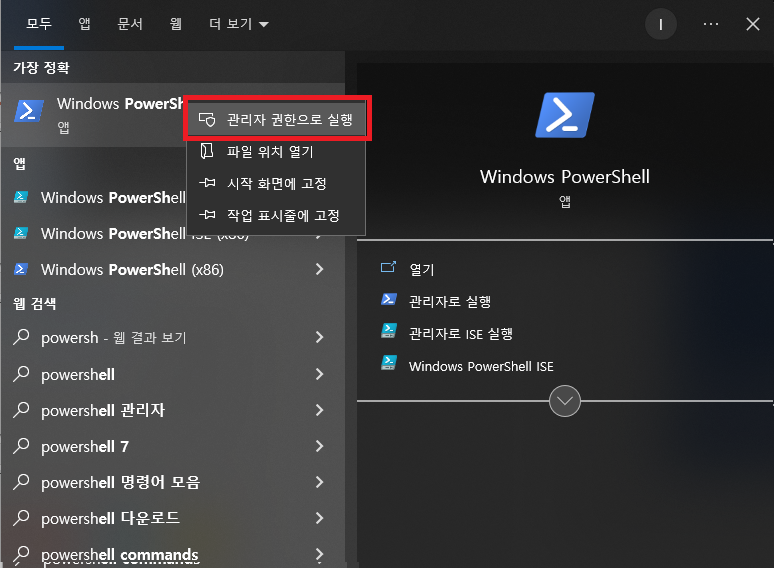
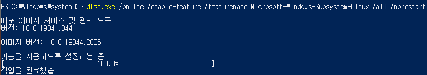
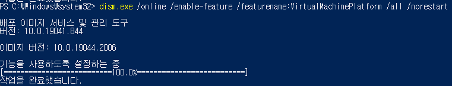
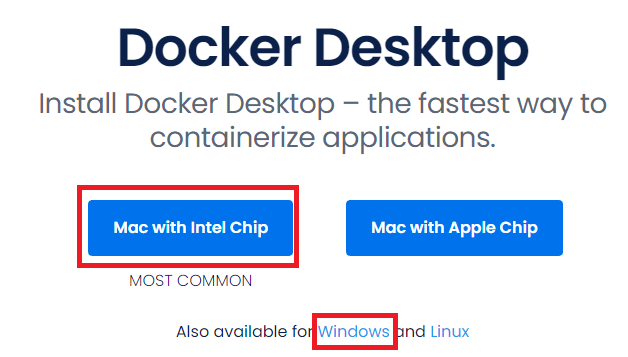
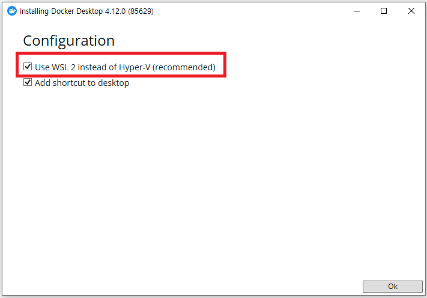
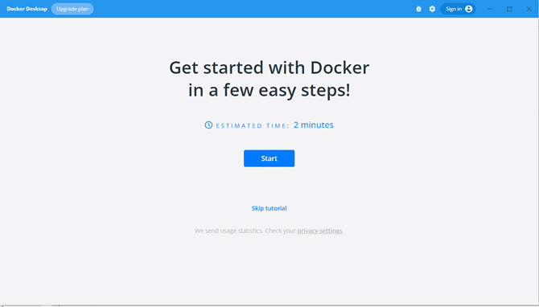
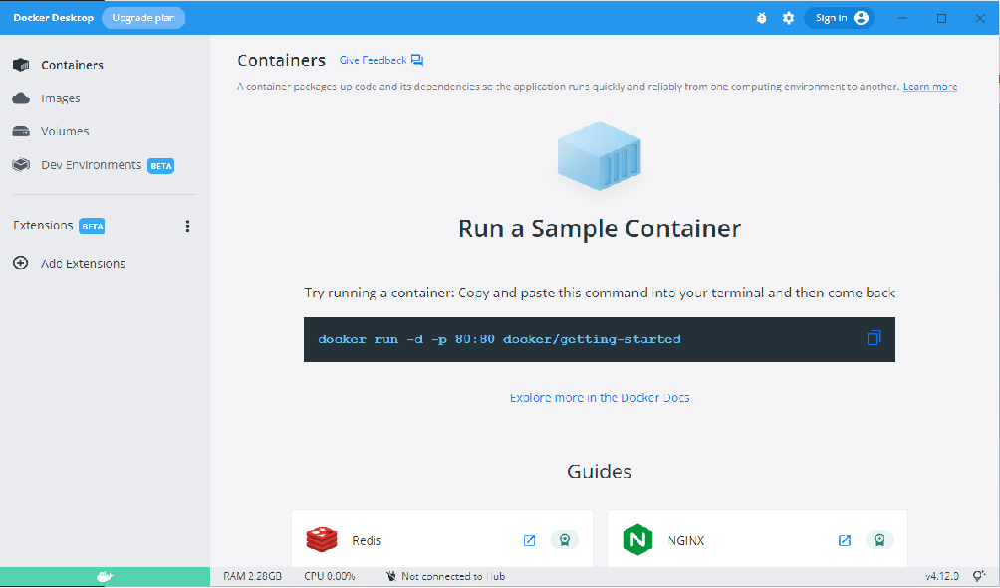

# Install Docker

## Prepare For Window

1. Window PowerShell을 관리자 권한으로 실행  
2. WSL 활성화
    ~~~
    $ dism.exe /online /enable-feature /featurename:Microsoft-Windows-Subsystem-Linux /all /norestart
    $ dism.exe /online /enable-feature /featurename:VirtualMachinePlatform /all /norestart
    ~~~
    아래 그림과 같이 "작업을 완료하였습니다" 라는 문자열과 함께 성공하는지 확인  
     
     
3. 재부팅
4. [WSL2 커널 업데이트 패키지](https://wslstorestorage.blob.core.windows.net/wslblob/wsl_update_x64.msi)를 다운로드 받아 설치 
5. 재부팅
   

## Install Docker Desktop

1. [Docker 공식 사이트](https://www.docker.com/products/docker-desktop/)에 접속 
2. 운영체제에 맞는 프로그램 다운로드 
    
3. **윈도우 운영체제만** 
    

## Launch Docker Desktop
1. Skip tutorial 버튼을 눌러 튜토리얼 스킵 
    
2. 다음과 같은 화면에서 실습을 준비
    
3. 아래의 명령어 입력
~~~
$ docker version
~~~
4. 아래의 명령어 입력
~~~
$ docker run -p 4567:80 -d nginx:latest
~~~